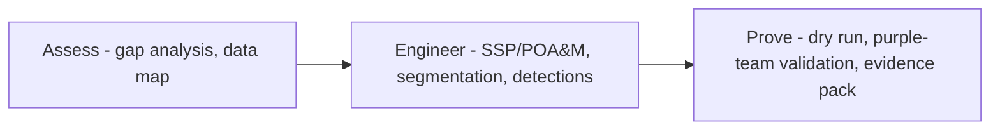

# 🛡 SENTINEL

**Cybersecurity Consulting & Compliance Engineering — practice showcase**

*Compliance, engineered — not performed.*

---

## What this is

SENTINEL is Dark Cloud Corp's consulting practice: **CMMC 2.0, IEC 62443, NIST SP 800-171, NERC CIP, and CNSA 2.0 post-quantum readiness** — engineered into operations by a veteran-led SDVOSB.

This repository hosts the **interactive practice showcase** — a client-side simulated assessment dashboard demonstrating how we scope, score, and roadmap engagements. **Sample data, illustrative only.**

> [!IMPORTANT]
> Showcase repository — readiness scores, control statuses, and the radar are simulated sample data showing the reporting format clients receive. Engagements are scoped and contracted individually.

## ▶ Try it

**[Open the live readiness dashboard →](https://wilbtc.github.io/cyber-consulting/)**

What you'll see:

| Panel | Demonstrates |
|---|---|
| Framework Readiness | CMMC 2.0 / IEC 62443 / 800-171 / NERC CIP / CNSA 2.0 scorecards |
| Maturity Radar | NIST CSF function-level maturity visualization |
| Control Status | Gap / in-progress / operational per control family |
| 90-Day Roadmap | Baseline → Engineer → Prove engagement arc |
| Engagement Packages | Assess / Implement / Operate+PQC tiers |

## Engagement arc

## Practice surfaces

| Surface | Deliverables |
|---|---|
| CMMC 2.0 | Gap assessment, SSP, POA&M, assessor-ready evidence, dry run |
| IEC 62443 | Zone & conduit segmentation, SL-2 target posture, secure development practice |
| NIST 800-171 / DFARS | Control implementation, POA&M, SPR scoring prep |
| NERC CIP | Asset classification, access controls, audit-ready evidence |
| CNSA 2.0 / PQC | Crypto inventory, HNDL risk mapping, ML-KEM/ML-DSA migration roadmap |
| Adversary validation | Delivered via [NIGHTFALL](https://github.com/WilBtc/red-team-ops) red-team engagements |
| Managed operations | Delivered via [AEGIS](https://github.com/WilBtc/darkcloud-soc) AI SoC |

---

**[Dark Cloud Corp](https://wilbtc.github.io/darkcloudcorp/)** · SDVOSB · Miami, FL

[AI SoC](https://github.com/WilBtc/darkcloud-soc) · [Red Team Ops](https://github.com/WilBtc/red-team-ops) · [Consulting](https://github.com/WilBtc/cyber-consulting)

© 2026 Dark Cloud Corp — showcase repository, all rights reserved

